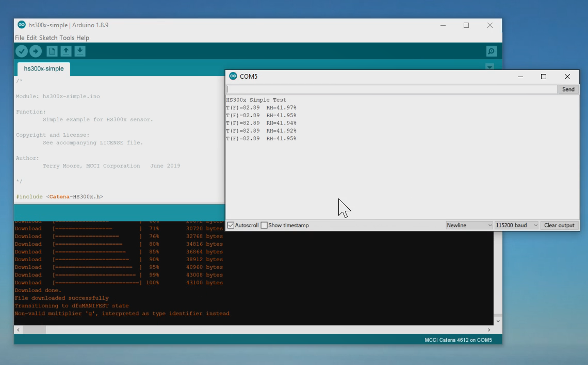

# MCCI Catena&reg; IDT HS300x Sensor Library

This library provides a simple interface to IDT HS3001 and HS3002 temperature/humidity sensors. Although we tested this on the MCCI Catena 4617, there are no dependencies on MCCI hardware; this should work equally well with IDT breakout boards, etc.

<!-- TOC depthFrom:2 updateOnSave:true -->

- [Introduction](#introduction)
- [Header File](#header-file)
- [Library Dependencies](#library-dependencies)
- [Example Scripts](#example-scripts)
- [Namespace](#namespace)
- [Instance Object](#instance-object)

<!-- /TOC -->
## Introduction

Clients interact with IDT HS300x sensors via the following sequence.

1. Initially, the client creates an instance object for the sensor. When creating the object, the client passes a `Wire` object (representing the I2C bus used for communication). Since the address of the HS300x is fixed at 0x44, there is no need to provide the address.

2. When the client wants to take a measurement, the client calls either the `cHS300x::getTemperatureHumidity()` method (which returns temperature and humidity scaled in engineering units), or `cHS300x::getTemperatureHumidityRaw()` (which returns temperature and humidity as `uint16_t` unscaled values).  Generally, the former is used if data is to be processed locally on the Arduino, and the latter is used if data is to be transmitted via a LPWAN network.

3. If the client needs to overlap measurements with computation, the client first calls `cHS300x::startMeasurement()` to start measurement. The result of this call is the number of milliseconds to delay before the measurement is likely to be active.

   To collect results, the client occasionaly calls `cHS300x::getMeasurementResults()` or `cHS300x::getMeasurementResultsRaw()`. If a measurement is available, it will be returned, and the method returns `true`; otherwise, the method returns `false`.  To save power, the client should delay the appropriate number of milliseconds between calls (as indicated by the result of `cHS300x::startMeasurement()`).

Utility methods allow the client to manage the sensor.

- `cHS300x::end()` idles the device, and is typically used prior to sleeping the system.
- For convenience, static methods are provided to convert between raw (`uint16_t`) data and engineering units. `cHS300x::rawToCelsius()` and `cHS300x::rawRHtoPercent()` convert raw data to engineering units. `cHS300x::celsiusToRawT()` and `cHS300x::percentRHtoRaw()` convert engineering units to raw data. (This may be useful for precalculating alarms, to save on floating point calculations at run time.)
- `cHS300x::isDebug()` returns `true` if this is a debug build, `false` otherwise. It's a `constexpr`, so using this in an `if()` statement is equivalent to a `#if` -- the compiler will optimize away the code if this is not a debug build.

"Raw data", in the case of HS300x sensors, is only 14 bits (for both temperature and humidity). For consistency with other sensors, we arrange them in a 16-bit word as follows.

| `15 14 13 12 11 10 9 8 7 6 5 4 3 2` | `1  0` |
|:-----------------------------------:|:----:|
| data from sensor, justified with MSB at bit 15 | zero |

This matches temperature from the sensor, but humidity is left-shifted two bits relative to values fetched from the sensor.

## Header File

```c++
#include <Catena-HS300x.h>
```

## Library Dependencies

None, beyond the normal Arduino library `<Wire.h>`.  It can be used with [Catena-Arduino-Platform](https://github.com/mcci-catena/Catena-Arduino-Platform), but it doesn't require it.

## Example Scripts

See [hs300x-simple](./examples/hs300x-simple/hs300x-simple.ino). Hs300x-simple reads and displays the temperature and humidity once a second, using the simple APIs.



## Namespace

All definitions are wrapped in a namespace. Normally, after incluing the header file, you'll want to say:

```c++
using namespace McciCatenaHs300x;
```

## Instance Object

An instance object must be created for each HS300x sensor to be managed. The constructor must specify:

- The `Wire` object to be used to communicate with the sensor.

A typical initialization will look like this:

```c++
using namespace McciCatenaSht3x;

cHS300x myHS300x(Wire);
```
